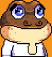

# **OUR COIN: The White Paper**

---

### **1. Introduction**
OUR COIN is a unique cryptocurrency that mixes humor, technology, and cultural satire. Inspired by jokes and parodies of communism, OUR COIN is all about shared effort and equal participation. It’s not just a cryptocurrency; it’s a fun way to express creativity and bring people together.

---

### **2. The Origin Story**
OUR COIN started as a joke on Facebook called "OurSQL," a funny communist parody featuring the hammer and sickle and Bugs Bunny worshipping the collective ideal. In Eastern Europe, we often use humor to make fun of the communist past. From satirical posters to underground clubs decorated with rusty propaganda plates, there’s a rich tradition of laughing at history.

For example, old signs once found in coal mines said things like, "All proud communists together underground" — a literal translation from Cyrillic. Inspired by these jokes, I created a GitHub space called "OurShell" because I write scripts in PowerShell. Then, I decided to tokenize the idea and created OUR COIN.

This project celebrates the funny side of "no my, only our" and brings it to the digital age with a playful twist.

---

### **3. The Team**

#### **Boris Andonov**

**Role:** Architect and Visionary  
Boris is the mastermind behind OUR COIN. A real person using his real name, he is transparent, doxxed, and proud to be a "based dev." Boris’s leadership combines technical skill with creativity, making this project both fun and meaningful.

#### **Conny**

**Role:** Technical Lead and Community Builder  
Conny is the backbone of OUR COIN. They handle technical work, manage social media, and build a strong community. From solving technical issues to engaging with users, Conny keeps the project running smoothly.

#### **CSA and Coop Commander**  
**Role:** Devs of SILKHAT Coin and Community Contributors  
CSA and Coop Commander are developers at SILKHAT Coin. Their decision to join OUR COIN’s community is heartwarming and brings valuable expertise and enthusiasm to the team. They embody the spirit of collaboration that OUR COIN is all about.

---

### **4. Technical Foundations**

OUR COIN’s humor is matched by its strong technical foundation. It’s built with advanced scripting and frameworks, reflecting years of expertise.

- **PowerShell Expertise:**  
   My GitHub projects focus on PowerShell, solving complex technical problems with advanced solutions. I’ve created responsive GUIs, worked with diverse frameworks, and built innovative tools.

- **Math and Music Projects:**  
   I’ve also explored theoretical ideas in math and music, like improving the equal temperament system and experimenting with four-dimensional sound. These projects showcase creativity and problem-solving skills that drive OUR COIN.

---

### **5. Vision and Purpose**

OUR COIN is a parody—a lighthearted nod to collectivist ideals with a digital twist. But beyond the jokes, it’s a project with real technical depth and a welcoming community.

- **A Symbol of Collective Humor:**  
   OUR COIN celebrates the funny side of communal ideologies while using blockchain’s decentralized principles.

- **Community and Collaboration:**  
   It’s about sharing, contributing, and having fun together.

---

### **6. Conclusion**
OUR COIN is a mix of humor, technology, and cultural commentary. It’s a decentralized project where sharing and collaboration are key. By combining technical skills with playful creativity, it shows that cryptocurrency can be fun and inclusive.

Join the revolution. Together, we’re building something absurdly brilliant.
